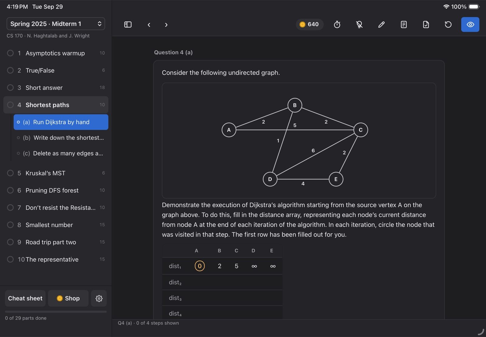
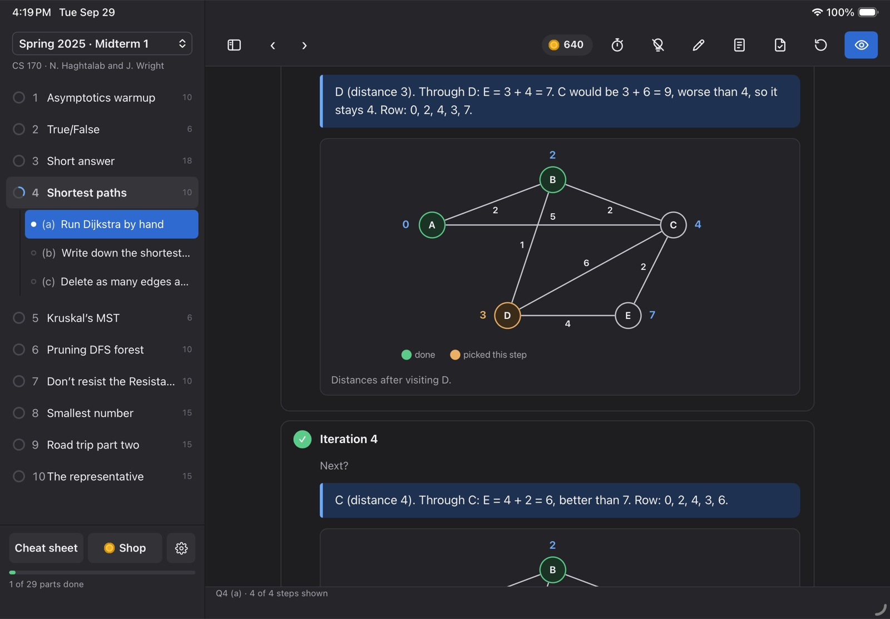

# CS 170 Walkthrough

## Put it on your iPad

1. Plug your iPad into your Mac with a cable and unlock it. If it asks "Trust This Computer?", tap Trust.
2. Tell your coding agent (Claude Code, Codex, …): "Install https://github.com/axel-slid/cs170-walkthrough on my iPad."
3. On the iPad, open Settings → Privacy & Security → Developer Mode and turn it on. (If you don't see it, it shows up after the agent's first install attempt.)
4. The iPad restarts. Unlock it and tap Turn On.
5. Tell your agent to install it again if it stopped.
6. Open Settings → General → VPN & Device Management, tap your Apple ID under Developer App, and tap Trust.
7. Open CS 170 Walkthrough and enjoy.

For the agent: the Mac needs Xcode (signed in with an Apple ID) and XcodeGen (`brew install xcodegen`). In `ios/project.yml`, set `DEVELOPMENT_TEAM` to the user's team ID and change `bundleIdPrefix` / `PRODUCT_BUNDLE_IDENTIFIER` to something unique to them. Then run `ios/install-ipad.sh` with the iPad plugged in and unlocked.
